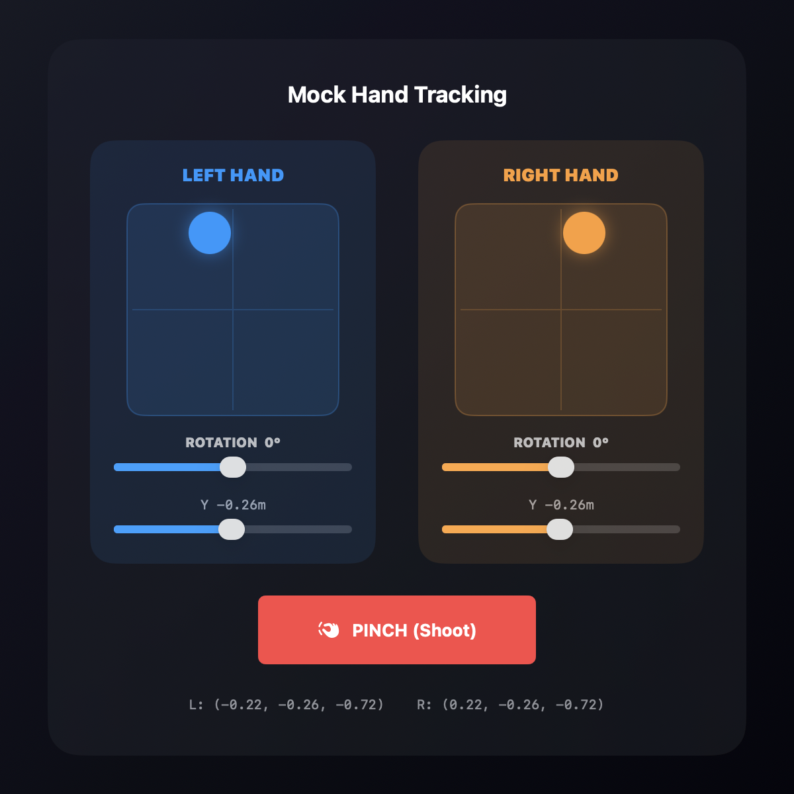
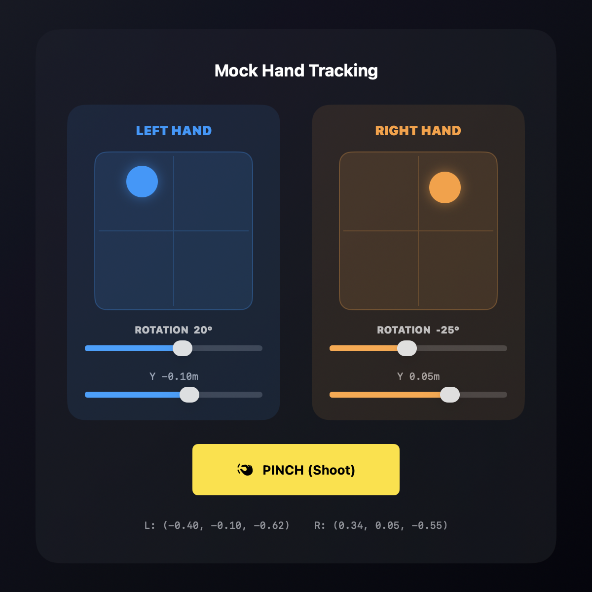

# DicyaninMockHandTracking

Simulated hand tracking for visionOS. Drives mock hand positions and pinch gestures so hand-tracked apps can be developed and tested in the visionOS simulator, where ARKit hand tracking isn't available.

The idea: write your app against one hand-pose source. In the **simulator** it reads from `MockHandTrackingController` and you steer the hands with an on-screen control panel. On a **real device** the exact same call sites read live ARKit `HandAnchor` data — no changes to your app logic.

| Resting | Aiming + pinch |
| --- | --- |
|  |  |

## Install

```swift
.package(url: "https://github.com/hunterh37/DicyaninMockHandTracking.git", from: "2.0.0")
```

Then add `DicyaninMockHandTracking` to your target's dependencies.

## Usage

Read mock hand state from the shared controller in simulator builds instead of ARKit:

```swift
import DicyaninMockHandTracking

let controller = MockHandTrackingController.shared

// Published hand state
controller.leftHandPosition   // SIMD3<Float>, head-relative
controller.rightHandPosition
controller.leftHandYaw        // Float, radians
controller.rightHandYaw
controller.isPinching         // Bool

// Fire a momentary pinch
controller.simulatePinch()

// 60 fps update stream
for await _ in controller.updates() {
    // read positions each tick
}
```

Add the on-screen control overlay (joysticks + rotation sliders + pinch) to your simulator UI:

```swift
import SwiftUI
import DicyaninMockHandTracking

MockHandControlView()
```

## Simulator vs. device

Put the source switch behind a single type so your app never branches on environment. In the simulator it reads the mock controller; on device it reads ARKit `HandAnchor`s:

```swift
import simd
import DicyaninMockHandTracking
#if !targetEnvironment(simulator)
import ARKit
#endif

struct HandPose {
    var position: SIMD3<Float>
    var isPinching: Bool
}

@MainActor
final class HandSource {
    #if targetEnvironment(simulator)
    // --- Simulator: driven by MockHandControlView ---
    private let mock = MockHandTrackingController.shared

    func rightHand() -> HandPose {
        HandPose(position: mock.rightHandPosition, isPinching: mock.isPinching)
    }

    /// 60 fps tick stream you can await in your update loop.
    func updates() -> AsyncStream<Void> { mock.updates() }

    #else
    // --- Device: real ARKit hand tracking ---
    private let session = ARKitSession()
    private let provider = HandTrackingProvider()

    func start() async throws {
        try await session.run([provider])
    }

    func rightHand() -> HandPose {
        guard let anchor = provider.latestAnchors.rightHand,
              anchor.isTracked,
              let wrist = anchor.handSkeleton?.joint(.wrist) else {
            return HandPose(position: .zero, isPinching: false)
        }
        let m = anchor.originFromAnchorTransform * wrist.anchorFromJointTransform
        let position = SIMD3<Float>(m.columns.3.x, m.columns.3.y, m.columns.3.z)
        return HandPose(position: position, isPinching: detectPinch(anchor))
    }
    #endif
}
```

Your game/app code then just calls `handSource.rightHand()` and never knows which backend produced it. Swap `MockHandControlView()` into a window only in simulator builds:

```swift
#if targetEnvironment(simulator)
MockHandControlView()
#endif
```

## Example app

A complete, runnable visionOS example lives in [`Examples/HandTrackingDemo`](Examples/HandTrackingDemo). It opens an immersive space with a **green sphere that follows the mock right hand** — drag the right-hand joystick in `MockHandControlView` and the sphere moves with it. It uses the same `HandSource` abstraction shown above, so the code path is identical on a real device.

The project is defined with [XcodeGen](https://github.com/yonaskolb/XcodeGen) (`project.yml`) and the generated `.xcodeproj` is checked in, so you can either open it directly or regenerate it:

```bash
# Just open it
open Examples/HandTrackingDemo/HandTrackingDemo.xcodeproj

# …or regenerate the project from project.yml
cd Examples/HandTrackingDemo && xcodegen generate
```

Then run the `HandTrackingDemo` scheme on a visionOS simulator, tap **Open Immersive Scene**, and steer the right-hand joystick.

## Requirements

- visionOS 1.0+
- Swift 5.9+

## License

MIT — see [LICENSE](LICENSE).

---

## 🚀 Built With These Packages

We ship these packages for free, and run them in our own published visionOS apps on the App Store:

### [CYBERZOMBIES](https://apps.apple.com/us/app/id6770111930): powered by [DicyaninHandTracking](https://github.com/hunterh37/DicyaninHandTracking)


Room-scale spatial combat where you raise your hands, lock on, and blast waves of cyber-infected enemies that spill out of your own walls, built on hand-driven aiming and `DicyaninARKitSession`.

### [RealityMesh](https://apps.apple.com/us/app/id6474943391): powered by [DicyaninSceneReconstruction](https://github.com/hunterh37/DicyaninSceneReconstruction)


Uses ARKit and the LiDAR Scanner to build a live mesh of your surroundings, then reskins your real room with customizable textures.

### [Spatial Model Viewer](https://apps.apple.com/us/app/id6475698595): powered by [DicyaninAssetPreloader](https://github.com/hunterh37/DicyaninAssetPreloader)


Turns your space into a 3D modeling studio with glow and procedural shader effects, loading and cloning models on demand without parsing from disk on the main thread.
